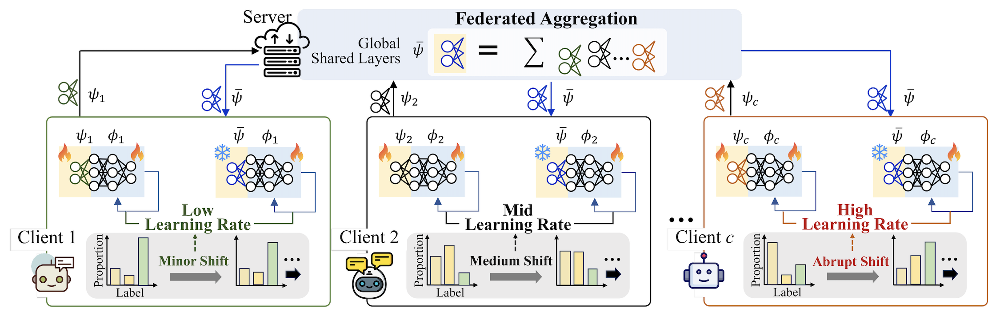

# Fed-ADE

> **CVPR 2026** | [📄 Paper](https://openaccess.thecvf.com/content/CVPR2026/html/Park_Fed-ADE_Adaptive_Learning_Rate_for_Federated_Post-adaptation_under_Distribution_Shift_CVPR_2026_paper.html)

Fed-ADE is an unsupervised federated post-adaptation framework for non-stationary client data streams. It estimates local distribution dynamics from prediction uncertainty and representation drift, then assigns a client- and timestep-specific adaptive learning rate.

This release currently includes image experiments only. The LAMA/text experiments are not included in this repository.

## Overview

Fed-ADE performs post-deployment adaptation in a federated setting where each client receives unlabeled data over time. The method combines two lightweight signals:


<p align="center">
  
</p>

- **Uncertainty dynamics**: cosine distance between consecutive batch-level softmax summaries.
- **Representation dynamics**: cosine distance between consecutive normalized feature summaries.

The two signals are averaged and mapped to a bounded learning rate:

```text
lr_t = lr_min + (lr_max - lr_min) * shift_score_t
```

## Repository structure

```text
Fed-ADE_release/
├── README.md
├── requirements.txt
├── environment.yml
├── run_experiment.py
├── scripts/
│   └── download_data.sh
└── experiments/
    ├── label_shift/
    │   ├── CIFAR/
    │   │   ├── ADE.py
    │   │   └── model/pretrained_uniform_CIFAR10.pth
    │   └── TinyImageNet/
    │       ├── ADE.py
    │       └── model/pretrained_uniform_TinyImageNet.pth
    └── covariate_shift/
        ├── CIFAR/
        │   ├── ADE.py
        │   └── model/pretrained_uniform_CIFAR10.pth
        └── CIFAR100/
            ├── ADE.py
            └── model/pretrained_uniform_CIFAR100.pth
```

The original notebooks were converted into Python files. The previous `sim_ADE_*.ipynb` sweep notebooks are replaced by the command-line runner `run_experiment.py`.

## Installation

### Conda

```bash
conda env create -f environment.yml
conda activate pfl
```

If you already have a conda environment named `pfl`, install the required packages inside it:

```bash
conda activate pfl
pip install -r requirements.txt
```

PyTorch installation can depend on your CUDA version. If the conda environment file does not match your machine, install PyTorch and torchvision following the official PyTorch selector, then install the remaining packages from `requirements.txt`.

## Data preparation

### CIFAR-10 and CIFAR-100

CIFAR-10 and CIFAR-100 are downloaded automatically through `torchvision.datasets` when running the corresponding experiments.

### CIFAR-10-C and CIFAR-100-C

Download and extract the corruption benchmarks into the following directories:

```text
experiments/covariate_shift/CIFAR/CIFAR-10-C/
experiments/covariate_shift/CIFAR100/CIFAR-100-C/
```

You can use the helper script:

```bash
bash scripts/download_data.sh
```

Expected CIFAR-10-C layout:

```text
experiments/covariate_shift/CIFAR/CIFAR-10-C/
├── labels.npy
├── gaussian_noise.npy
├── shot_noise.npy
└── ...
```

Expected CIFAR-100-C layout:

```text
experiments/covariate_shift/CIFAR100/CIFAR-100-C/
├── labels.npy
├── gaussian_noise.npy
├── shot_noise.npy
└── ...
```

### Tiny ImageNet

Download and extract Tiny ImageNet into:

```text
experiments/label_shift/TinyImageNet/tiny-imagenet-200/
```

The helper script also downloads Tiny ImageNet:

```bash
bash scripts/download_data.sh
```

Expected layout:

```text
experiments/label_shift/TinyImageNet/tiny-imagenet-200/
├── train/
├── val/
├── test/
├── wnids.txt
└── words.txt
```

## Pretrained models

This release includes only the **uniform pretraining distribution** checkpoints:

```text
pretrained_uniform_CIFAR10.pth
pretrained_uniform_CIFAR100.pth
pretrained_uniform_TinyImageNet.pth
```

Non-uniform pretraining checkpoints used for additional analysis are not included.

## Running experiments

All experiments are launched from the repository root.

### Label shift on CIFAR-10

```bash
python run_experiment.py \
  --shift-type label \
  --dataset cifar10 \
  --shift lin \
  --seed-index 0 \
  --dist uniform \
  --gpu 0
```

### Label shift on Tiny ImageNet

```bash
python run_experiment.py \
  --shift-type label \
  --dataset tinyimagenet \
  --shift sin \
  --seed-index 0 \
  --dist uniform \
  --gpu 0
```

### Covariate shift on CIFAR-10-C

```bash
python run_experiment.py \
  --shift-type covariate \
  --dataset cifar10c \
  --shift squ \
  --seed-index 0 \
  --dist uniform \
  --gpu 0
```

### Covariate shift on CIFAR-100-C

```bash
python run_experiment.py \
  --shift-type covariate \
  --dataset cifar100c \
  --shift ber \
  --seed-index 0 \
  --dist uniform \
  --gpu 0
```

Available shift schedules:

```text
lin, sin, squ, ber
```

Useful overrides:

```bash
python run_experiment.py --shift-type label --dataset cifar10 --shift lin \
  --seed-index 0 \
  --lr-min 1e-5 \
  --lr-max 1e-3 \
  --timesteps 100 \
  --rounds 10 \
  --num-client 100
```

For a quick smoke test, reduce the scale:

```bash
python run_experiment.py --shift-type label --dataset cifar10 --shift lin \
  --seed-index 0 --timesteps 2 --rounds 1 --num-client 10
```

## Notes

- The converted `ADE.py` files preserve the original experimental logic as much as possible.
- The command-line runner injects runtime values such as shift schedule, seed index, learning-rate bounds, GPU index, and dataset paths.
- This release pack is intended as a cleaner GitHub-facing version of the research code. Further modularization can split the code into `datasets`, `models`, `fedade`, and `utils` packages.

## Citation

```bibtex
@inproceedings{park2026fedade,
  title={Fed-ADE: Adaptive Learning Rate for Federated Post-adaptation under Distribution Shift},
  author={Park, Heewon and Joe, Mugon and Kim, Miru and Im, Kyungjin and Kwon, Minhae},
  booktitle={Proceedings of the IEEE/CVF Conference on Computer Vision and Pattern Recognition},
  year={2026}
}
```
